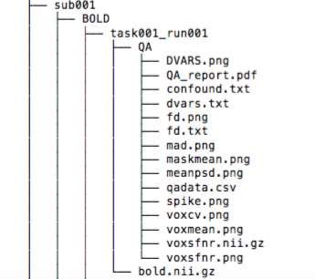

% Project Kappa Progress Report
% Zheng Chang, Giancarlo Escobar, Noel Pimentel, Imran Yousuf, 
% November 12, 2015

# Background

## The Paper
- "Distributed and overlapping representations of faces and objects in ventral temporal cortex" Haxby et al.
- "Combinatorial codes in ventral temporal lobe for object recognition: Haxby (2001). revisited: is there a face area?" Hanson et al.
- "Partially distributed representations of objects and faces in ventral temporal cortex" O'Toole et al.
- from OpenFMRI.org
- ds105 

## The Data

- 6 subjects (sub001, sub002, .., sub006)
- 1 task (object viewing)
- 8 conditions per task (house, scrambled, cat, shoe, bottle, scissors, chair, face)
- 12 runs per subject (72 bold.nii files)

## The Method

-Haxby Similarity Method
	-Data for each subject were split into two sets, even and odd runs
	-Within category correlation was compared to between category correlation
	-Excluded maximally responsive voxels and again compared within category correlation to between category correlation
	
# Initial work

## EDA / Preprocessing

- Downloaded data
- Examination of folder structure of ds105
- Code to merge individual 12 bold.nii files for sub001, sub002, etc. and export as sub001.nii, sub002.nii, etc.
- Applied HW2 diagnosis_script.py for each individual subject
- Simple plots, summary statistics
- Convolution

## Task Time Course

## Data Folder Structure

# Next steps

## The Plan

We wish to perform further descriptive, exploratory, inferential and predictive analysis of the Haxby data while adhering to the methods of Hanson et al.  Hanson et al. used a neural network classifier that achieved a 83 percent correct generalization performance on patterns of voxel responses in out-of-sample tests (i.e. testing data). Our plan is to surpass this performance while implementing this and different machine learning and techniques along the way in order to compare method performance and gain further insight of the fMRI data

## Preprocessing / Validation

- PCA/PLS (dimension reduction)
- Bootstrap/Jackknife (estimation)
- K fold Cross Validation (test error rate estimation, tuning parameter selection)

## Statistical Analysis

- Linear Model (t-testing)
- ANOVA (Model comparison)
- Machine Learning (Neural network, LDA, random forests, boosting, SVM, GAM, stacking)

## Potential Problems

- Feeling comfortable with the neural network
- Learning how to use scikit learn package
- Validation methods (e.g. validation set/test set)
- Computer performance (slow performance) may cause us to avoid certain methods 
- Inference
    - Which methods of feature selection should be used? 
    - Use methods that produce sparse models?
- BIGGEST ISSUE: understanding the data
    - Are we making the wrong statistical assumptions?
    - Noise vs signal?
    - etc.. more to come 
